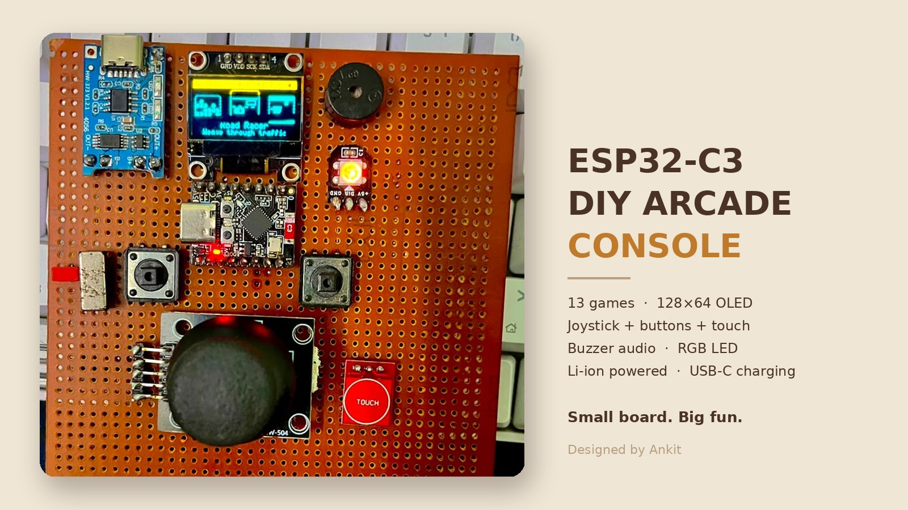
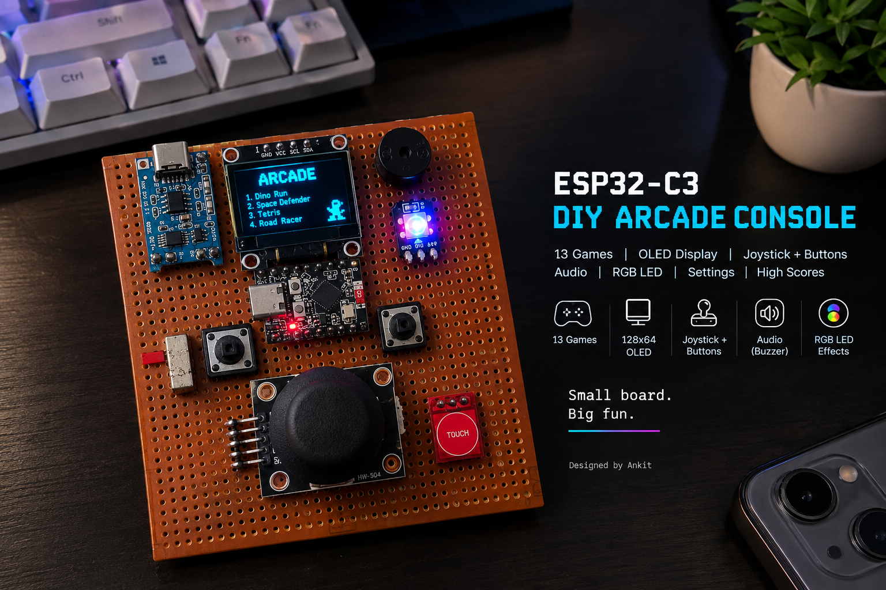
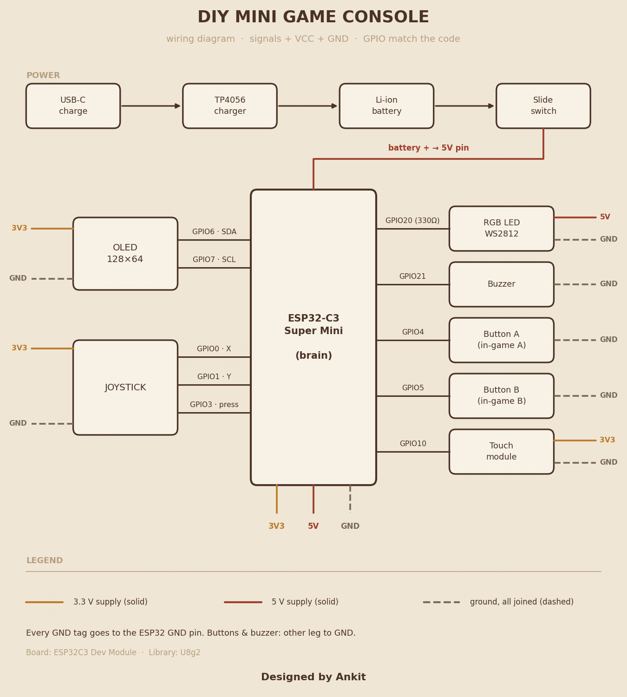
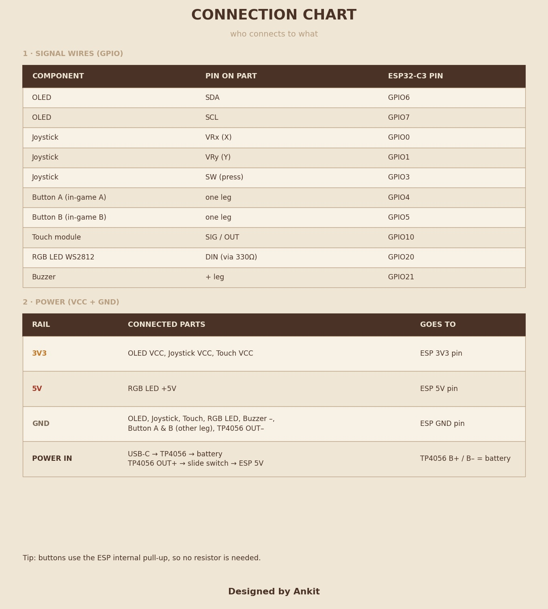

# ARCADE-C3

**A handheld multi-game console on an ESP32-C3 Super Mini and a 128×64 OLED.**



ARCADE-C3 is an Arduino firmware for a perfboard-built handheld. It boots into an animated launcher with 13 games, a settings screen and a hardware test. Input comes from an analog joystick, two buttons and a touch pad. Sound is played through a buzzer and an RGB LED reacts to what is happening in the game. Settings and high scores are stored in the ESP32 flash (NVS) and survive power-off.

The whole firmware is plain Arduino C++ (one `.ino` sketch plus header files). The only external library is U8g2.



## Contents

- [Features](#features)
- [Games](#games)
- [Hardware](#hardware)
- [Pin mapping](#pin-mapping)
- [Controls](#controls)
- [Software architecture](#software-architecture)
- [Repository structure](#repository-structure)
- [Build and flash](#build-and-flash)
- [Configuration](#configuration)
- [Settings and high scores](#settings-and-high-scores)
- [Adding a new game](#adding-a-new-game)
- [Troubleshooting](#troubleshooting)
- [Known limitations](#known-limitations)
- [Roadmap](#roadmap)
- [License](#license)

## Features

- 13 games plus two system screens (Settings, HW Test), all listed in one table (`GAMES[]` in `games.h`).
- Carousel launcher with animated cards, per-game icon, one-line description and the saved best score.
- Intro card before each game showing its controls; a pause menu (resume, restart, sound, quit) during play.
- Joystick pipeline with 2-sample ADC averaging, low-pass smoothing, dead zone, response curve, hysteresis, auto-repeat and slow self-centering. Stick calibration at boot and from Settings.
- Sound engine with 16 effects played on a buzzer. Active and passive buzzers are both supported (selectable in Settings).
- WS2812 LED accent colour per game, flashing together with sound effects, with four brightness levels.
- Per-game high scores and settings stored with `Preferences` (NVS).
- Hardware test screen: live raw and processed stick values, button/touch state, test tones, LED response.
- Touch pad toggles sound at any time (hold about 120 ms).

## Games

| # | Game | Type | Controls | Notes |
|---|------|------|----------|-------|
| 0 | Dino Run | Endless runner | A / stick up: jump. B / stick down: duck (fast-fall in the air) | Birds, obstacle clusters, day/night switch |
| 1 | Space Defender | Side-scrolling shooter | Stick: fly (analog). Hold A: fire. B: bomb | 3 lives, up to 3 bombs. Power-ups: weapon level, shield, bomb, extra life. Boss every 4th level |
| 2 | Tetris | Falling blocks | Stick left/right: move (hold repeats). Stick down: soft drop. A / stick up: rotate. B: hard drop | 10×16 board, levels |
| 3 | Road Racer | Lane racer | Stick up/down: change lane. A: nitro. B: brake | 4 lanes, cars and trucks, coins refill nitro |
| 4 | Cave Copter | One-button flyer | Hold A or stick up: climb. Release: sink | Caves narrow, pillars appear, speed grows |
| 5 | Snake | Classic snake | Stick: steer | Level up every 6 foods (faster, more rocks). Timed bonus star every 5th food, worth 3 |
| 6 | Breakout | Brick breaker | Stick left/right: paddle. A / stick up: launch | 5 layouts that repeat harder, wide-paddle and extra-life pickups, 3 lives |
| 7 | Pong | Paddle vs AI | Stick up/down | 3 lives. Every 5 points: faster ball, smarter AI, shorter paddle |
| 8 | Flappy | Tap-to-flap | A / stick up: flap | Level up every 6 pipes. From level 3 the pipes move |
| 9 | Simon | Memory pattern | Stick up/right/down/left: repeat the pattern | LED and tone for each step, pattern grows each round |
| 10 | Cricket | Batting chase | A: drive. B: loft. Stick: aim the shot | 2 overs (12 balls), 3 wickets, random target of 20 to 32 runs. Timing, line and loft decide 0, 1, 2, 3, 4, 6 or a wicket |
| 11 | Bounce Ball | Gravity paddle | Stick left/right: paddle | Every 5 returns: more gravity, narrower paddle. Paddle edge steers the ball |
| 12 | Temple Dash | 3-lane runner | Stick left/right: change lane. A: jump. B: slide | Jump low barriers, slide under beams, switch lane for walls. Speed rises with distance |
| 13 | Settings | System screen | See [Settings](#settings-and-high-scores) | No intro card, no pause menu |
| 14 | HW Test | System screen | A / B: test tones. Stick click: exit | Shows raw and processed input values |

## Hardware

Components that the firmware drives are listed first. Parts that are visible on the prototype but not referenced by the code are listed separately.

| Component | Purpose | Interface | GPIO | Notes |
|-----------|---------|-----------|------|-------|
| ESP32-C3 Super Mini | Main controller | n/a | n/a | Board setting in sketch header: `ESP32C3 Dev Module` |
| SSD1306 OLED, 128×64 | Display | I²C (hardware) | 6 (SDA), 7 (SCL) | U8g2 driver `U8G2_SSD1306_128X64_NONAME_F_HW_I2C`, bus clock 400 kHz |
| Analog joystick (HW-504 on the prototype) | Navigation and analog control | 2× ADC, 1× digital | 0 (X), 1 (Y), 3 (click) | Click uses the internal pull-up |
| Push button ×2 | Action buttons A and B | Digital, internal pull-up | 4 and 5 | See the note below the pin table |
| Touch module | Sound mute toggle | Digital input | 10 | Must be held about 120 ms. Sensor type is not specified in the current source |
| WS2812 RGB LED | Game accent colour and effects | Single-wire (`neopixelWrite`) | 20 | `config.h` comment: data line through a 330 Ω resistor |
| Buzzer | Sound effects | LEDC tone (passive) or on/off (active) | 21 | Type selected in Settings |

Visible on the prototype but not referenced by the firmware: TP4056 USB-C charger module, a slide switch and a Li-ion cell (battery and power path are not specified in the current source). The firmware has no battery-level reading.





## Pin mapping

Taken from `GameConsole/config.h`.

| GPIO | Macro | Function | Direction | Notes |
|------|-------|----------|-----------|-------|
| 0 | `PIN_JOY_X` | Joystick X axis | Analog in | 12-bit ADC values, centre about 2048 |
| 1 | `PIN_JOY_Y` | Joystick Y axis | Analog in | Same as above |
| 3 | `PIN_JOY_SW` | Joystick click | Input, pull-up | Active low. Pause menu / exit system screen |
| 4 | `PIN_BTN_B` | Button, in-game **A** | Input, pull-up | Active low |
| 5 | `PIN_BTN_A` | Button, in-game **B** | Input, pull-up | Active low |
| 6 | `PIN_SDA` | OLED SDA | I²C | |
| 7 | `PIN_SCL` | OLED SCL | I²C | |
| 10 | `PIN_TOUCH` | Touch pad | Input | Active high, no internal pull configured |
| 20 | `PIN_LED` | WS2812 data | Output | |
| 21 | `PIN_BUZZER` | Buzzer | Output (LEDC or digital) | |

Button naming: `config.h` has `BTN_SWAP_AB 1`, so the macros `PIN_BTN_A` (GPIO 5) and `PIN_BTN_B` (GPIO 4) are exchanged in software. The firmware's **A** (main action) is the button on **GPIO 4** and **B** (secondary) is the button on **GPIO 5**. Set `BTN_SWAP_AB` to `0` to reverse this.

## Controls

### Global

| Input | Where | Action |
|-------|-------|--------|
| Stick left/right or up/down | Launcher | Move through the games (hold to auto-repeat) |
| A or stick click | Launcher | Open the game's intro card (games) or open the screen directly (Settings, HW Test) |
| A or stick click | Intro card | Start the game |
| B | Intro card | Back to the launcher |
| Stick click | In a game | Open the pause menu |
| Stick up/down, A or click | Pause menu | Select and confirm: Resume, Restart, Sound ON/OFF, Quit to menu. B resumes |
| Stick click | HW Test | Exit to the launcher |
| B | Settings | Exit to the launcher |
| Touch pad (hold about 120 ms) | Anywhere after boot | Toggle sound, shows a "SOUND ON/OFF" toast |
| A / B | Game over box | A: play again. B: back to launcher (ignored for the first 0.5 s) |

Per-game controls are in the [Games](#games) table and are also shown on each game's intro card.

## Software architecture

Everything is compiled as one translation unit. `GameConsole.ino` includes `hal.h` (hardware layer) and `games.h` (game registry, which includes every game and `sys_misc.h`).

```
GameConsole.ino   boot animation, launcher, intro card, pause menu, main loop
   ├─ hal.h       display, input, audio, LED, settings, high scores, UI helpers
   │    └─ config.h   pins and tuning constants
   └─ games.h     Game struct, GAMES[] registry, GAME_DESC[]
        ├─ game_*.h   13 games
        └─ sys_misc.h Settings and HW Test screens
```

**Main loop** (`loop()` in `GameConsole.ino`), one pass every `FRAME_MS` (33 ms, about 30 fps):

1. `inputUpdate()`, `audioUpdate()`, `ledUpdate()`.
2. Touch handling (sound toggle).
3. Mode handler: `MODE_MENU`, `MODE_INTRO`, `MODE_PLAY` or `MODE_PAUSE`.
4. Clear the buffer, draw the current mode, then toast and banner overlays, then `sendBuffer()`.
5. Sleep until the frame time is used up.

**Game interface.** Every entry in `GAMES[]` is a `struct Game` with: name, LED accent colour (r, g, b), four function pointers `init()`, `update()`, `draw()`, `icon(x, y)`, two help strings for the intro card, and a `kind` field (0 = game, 1 = system screen). The launcher calls `init()` when a game starts, then `update()` and `draw()` once per frame. `icon()` draws a 32×32 preview in the launcher.

**Input layer** (`hal.h`, `struct Input in`). Games read a shared struct instead of GPIO:

| Field | Meaning |
|-------|---------|
| `dx`, `dy` | Held digital direction (-1/0/+1), with hysteresis and dominant-axis filtering |
| `px`, `py` | First press of a direction |
| `rx`, `ry` | Press plus auto-repeat (first repeat after 220 ms, then every 90 ms) |
| `ax`, `ay` | Analog value -100..+100 after dead zone, response curve and smoothing |
| `a`, `b`, `sw`, `touch` | Held state |
| `aP`, `bP`, `swP`, `touchP` | Press events (touch fires after 120 ms of contact) |

**Audio.** Effects are note tables (`Note {frequency, ms}`) selected by the `Sfx` enum. Each effect has a priority, and a lower-priority effect cannot interrupt a higher one. Playback is non-blocking and advanced from `audioUpdate()`. Passive buzzers use LEDC (`ledcWriteTone`); active buzzers are switched on and off. The sketch handles both ESP32 Arduino core 2.x and 3.x LEDC APIs.

**LED.** `ledSetBase()` sets the game's accent colour; `ledFlash()` overrides it for a short time; `fx(sfx, r, g, b, ms)` plays a sound and flashes in one call. Brightness is scaled by the level chosen in Settings.

**Persistence.** `Preferences` namespace `cfg` holds sound, LED level and buzzer type. Namespace `hs` holds one 16-bit score per game under key `g<id>`.

**Game over.** Games call `endRun(id, score, hi)`, which updates and stores the best score and plays the matching effect. `overKeys()` and `overBox()` provide the shared "GAME OVER / A:again B:menu" handling.

## Repository structure

```
.
├── GameConsole/               Arduino sketch folder (open GameConsole.ino)
│   ├── GameConsole.ino        boot, launcher, intro, pause, main loop
│   ├── config.h               pins and tuning constants
│   ├── hal.h                  display, input, audio, LED, settings, scores, UI helpers
│   ├── games.h                game registry and descriptions
│   ├── sys_misc.h             Settings and HW Test screens
│   └── game_*.h               one header per game (13 files)
├── docs/images/               banner, hero image, wiring diagram, connection chart
├── README.md
└── LICENSE
```

| File | Role |
|------|------|
| `GameConsole.ino` | Boot animation, launcher carousel, intro card, pause menu, main loop |
| `config.h` | GPIO map and tuning constants |
| `hal.h` | Display init, input processing, sound engine, LED control, NVS settings and scores, toast/banner/game-over helpers |
| `games.h` | `Game` struct, `GAMES[]`, `GAME_DESC[]`, includes all games |
| `sys_misc.h` | Settings and hardware-test screens (registered as `kind = 1`) |
| `game_*.h` | `dino`, `shooter`, `tetris`, `racer`, `copter`, `snake`, `breakout`, `pong`, `flappy`, `simon`, `cricket`, `bounce`, `temple` |

## Build and flash

**Requirements**

- Arduino IDE (version: not specified in the current source).
- ESP32 board package from Espressif. The sketch contains code paths for core 2.x and 3.x; the version used for development is not specified in the current source.
- Library: **U8g2** by olikraus (Library Manager). No other external library is included.

**Steps**

1. Copy or clone the `GameConsole/` folder. The folder name must match the sketch name.
2. Open `GameConsole/GameConsole.ino`.
3. Select the board **ESP32C3 Dev Module** and set **USB CDC On Boot: Enabled** (both from the header comment in the sketch).
4. Select the COM port and click Upload. Other board options such as flash size or partition scheme are not specified in the current source.
5. On first boot the firmware calibrates the stick centre, so keep the stick released while powering on. If the reading at boot is far from the nominal centre it falls back to 2048.

**First boot.** A 1.7 s animated logo ("ARCADE / ESP32-C3 GAME CONSOLE") plays with a boot jingle, then the launcher opens. Default settings: sound ON, LED medium, passive buzzer.

## Configuration

All compile-time options are in `GameConsole/config.h`.

| Setting | Value | Purpose | Effect of changing it |
|---------|-------|---------|-----------------------|
| `FRAME_MS` | 33 | Frame time (about 30 fps) | Lower is faster and smoother but all game speeds are tied to frames |
| `I2C_HZ` | 400000 | OLED bus clock | Comment suggests trying 800000 if the display is stable |
| `JOY_THRESH` | 900 | ADC counts from centre for a digital press | Higher needs a bigger push |
| `JOY_HYST` | 250 | Release threshold = `JOY_THRESH - JOY_HYST` | Prevents flicker at the edge |
| `JOY_DEAD` | 260 | Analog dead zone (counts) | Nothing happens inside it |
| `JOY_RANGE` | 1700 | Counts from centre for full deflection | Lower reaches full speed sooner |
| `JOY_FILT` | 3 | Smoothing, 1 (heavy) to 8 (none) | Lower is smoother and slower to respond |
| `BTN_SWAP_AB` | 1 | Swap A/B in software | `0` makes GPIO 5 = A and GPIO 4 = B |
| `JOY_SWAP_XY` | 0 | Swap stick axes | `1` exchanges X and Y |
| `JOY_INVERT_X` | 0 | Invert X | `1` mirrors left/right |
| `JOY_INVERT_Y` | 0 | Invert Y | `1` mirrors up/down |

Runtime settings (saved in flash) are in Settings: sound, LED brightness, buzzer type. LED levels are fixed in `hal.h` as `{0, 12, 40, 110}` out of 255 for OFF, LOW, MED, HIGH.

## Settings and high scores

Open **Settings** from the launcher. Up/down selects, A or stick left/right changes the value, B goes back.

| Item | Behaviour |
|------|-----------|
| Sound | ON / OFF |
| LED brightness | OFF / LOW / MED / HIGH, with a white flash as preview |
| Buzzer type | ACTIVE / PASSIVE. Changing it shows "RESTARTING..." and reboots the board |
| Sound test | A cycles through 1200, 2000, 2700 and 3500 Hz |
| Calibrate stick | Re-measures the stick centre (keep it released) |
| Reset scores | Hold A for about one second to clear all stored high scores |

High scores are 16-bit values per game. The launcher shows the best score of the highlighted game, and the intro card shows it as "BEST".

## Adding a new game

The registry design is documented in `games.h`: write the game header, include it, add one line to `GAMES[]`. The launcher, intro card, pause menu, sound/LED effects and high scores come with it.

1. **Create `GameConsole/game_name.h`** with `#pragma once` and a unique ID: `#define XX_ID 13`. The ID must equal the game's index in `GAMES[]` because it is also the NVS key (`g13`).
2. **Implement four functions**: `xxInit()`, `xxUpdate()`, `xxDraw()`, `xxIcon(int x, int y)`. Keep state in `static` variables with a unique prefix to avoid name clashes, because all headers share one translation unit.
3. **Init** resets the game state and loads the saved best score: `xxHi = hiGet(XX_ID);`.
4. **Update** runs once per frame. Read input only from `in` (`in.aP`, `in.ax`, `in.dx` and so on). Do not read GPIO directly.
5. **Draw** only draws. Use `u8g2` (128×64), `FONT_S` / `FONT_M`, `textC()`. Do not call `clearBuffer()` or `sendBuffer()`; the main loop does it.
6. **Game over**: call `endRun(XX_ID, score, xxHi)` once, then in `update()` use `if (overKeys()) xxInit();` and in `draw()` call `overBox(score, xxHi);`. Setting `gotoMenu = true` returns to the launcher (`overKeys()` does this on B).
7. **Feedback**: `fx(SFX_COIN, C_GOLD, 80)` plays a sound and flashes the LED; `bannerLevel(n)` shows a level banner; `sfx(...)` is sound only.
8. **Icon**: `xxIcon()` draws a 32×32 preview at (x, y) with primitives.
9. **Register**: in `games.h` add `#include "game_name.h"`, then add a line before the two system screens:
   ```cpp
   {"Name", r, g, b, xxInit, xxUpdate, xxDraw, xxIcon, "A:action", "Stick: move", 0},   // id 13
   ```
   Help strings are limited to 17 characters.
10. **Add a launcher description** to `GAME_DESC[]` in the same position (max 24 characters). A `static_assert` fails the build if the counts differ.
11. **Check the limit**: `hiCache[16]` in `GameConsole.ino` and the "reset scores" loop in `sys_misc.h` both cover 16 entries. Adding games beyond 16 total entries needs those two places updated.
12. **Test** with the hardware-test screen for input and by playing through a game over to confirm the score persists after a reboot.

## Troubleshooting

| Symptom | Where to look |
|---------|---------------|
| Black display | Check SDA = GPIO 6, SCL = GPIO 7 and the OLED address/driver. Try lowering `I2C_HZ` |
| Stick drifts or sticks to one direction | Re-calibrate in Settings, then tune `JOY_DEAD` and `JOY_THRESH` |
| Left/right or up/down reversed | Use `JOY_INVERT_X`, `JOY_INVERT_Y` or `JOY_SWAP_XY` |
| A and B feel swapped | Toggle `BTN_SWAP_AB` |
| No sound | Check Settings (sound ON), the touch toggle, and buzzer type (active vs passive) |
| Very quiet buzzer | The sound engine keeps tones in the 1.5 to 4.2 kHz range, where small buzzers are loudest. Check the buzzer type setting |
| LED stays off | LED brightness may be set to OFF in Settings |
| Compile error about U8g2 | Install U8g2 from the Library Manager |
| Serial output expected | The firmware does not use `Serial` |

## Known limitations

- Prototype stage: the hardware is on perfboard; no PCB or enclosure files are part of this project.
- Battery, charger and power switch are not handled by the firmware (no battery monitoring).
- Display is monochrome 128×64, so games use primitive-based graphics.
- Configuration is compile-time: pins, joystick tuning and button swap require re-flashing.
- Single translation unit with `static` globals in headers keeps the project small, but there are no separate `.cpp` modules or unit tests.
- Game IDs must be kept equal to their registry index by hand.
- The score store holds 16 entries and 16-bit values (Tetris clamps at 65535).
- Changing buzzer type reboots the device.
- Touch sensor model is not specified in the current source.
- No automated build or CI is included.

## Roadmap

**Completed**
- 13 games, launcher, intro cards, pause menu
- Settings, high scores in NVS, hardware test
- Joystick calibration and filtering, sound engine, LED effects

**Current**
- Public documentation, wiring diagram and connection chart

**Planned**
- Custom PCB replacing the perfboard
- Enclosure design
- Battery level reading and low-battery indicator
- Build instructions with exact tested core and library versions

**Possible future**
- More games and better sound (multi-note or music)
- Splitting headers into `.h/.cpp` modules
- Automated builds with Arduino CLI in CI
- Runtime button/axis remapping stored in NVS

## License

MIT. See `LICENSE`.

---

Designed by Ankit
